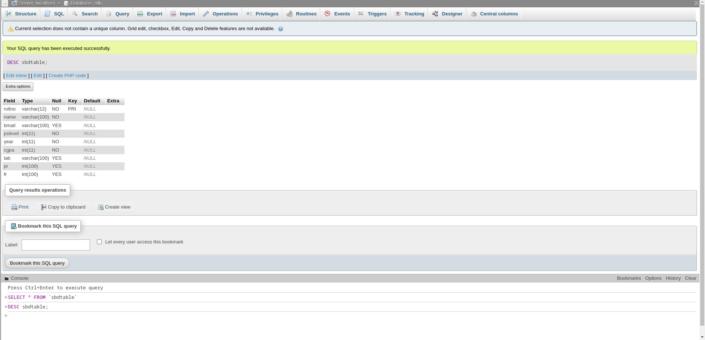
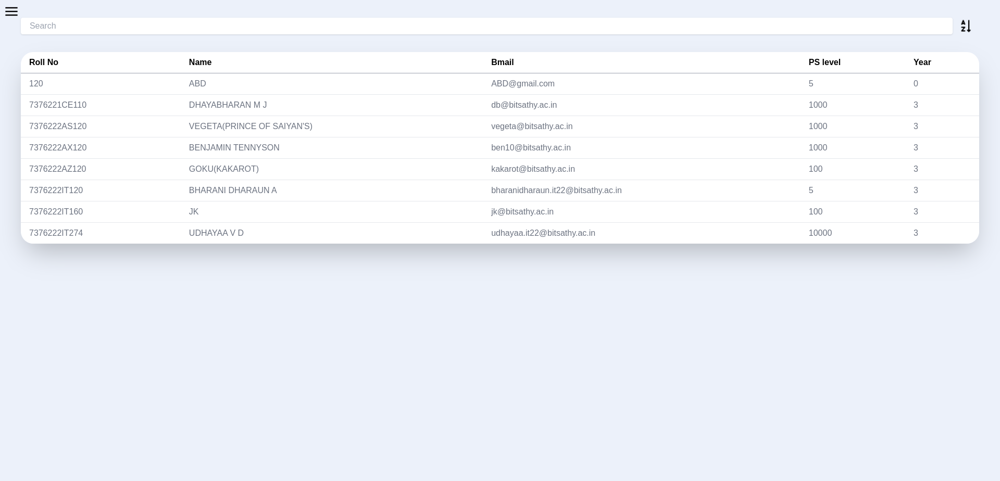
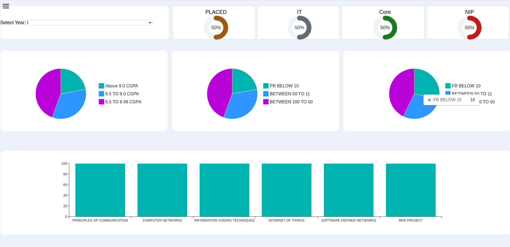

# Student Database Management System Using React
Student Dashboard and Performance Tracker is a web application designed for students to monitor their
academic performance with ease. Built using React,Node and SQL for database, it offers an interactive and user-friendly interface to
track progress and visualize data.
[!NOTE] This project is still in development, so there may be incomplete functionalities or customizations.
 Contributions and feedback are welcome!
 
 git clone https://github.com/DHAYABHARAN-MJ/STUDENT-DATABASE-MANAGEMENT
### Database
Make sure to create a table 
based on this preview

### Server
Feel free to change the server.js according to your database configuration
cd server
npm start

### FrontEnd
cd react-student-app
npm run dev

### Dashboard

### Students Overall Performance Tracker

